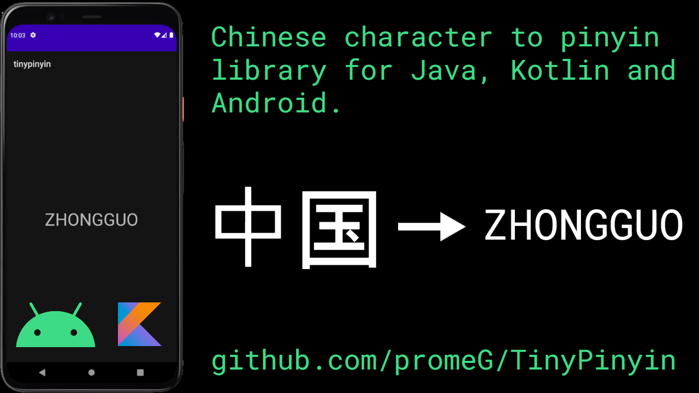
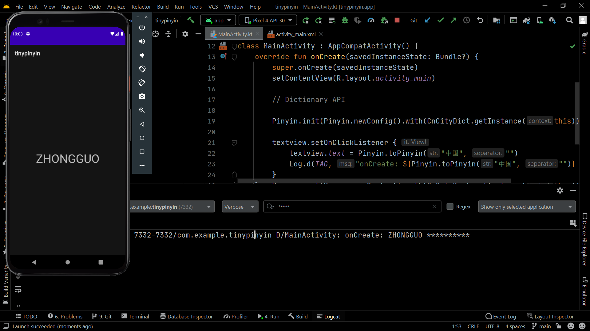

<h1 align="center">Tinypinyin</h1> 

Sample app for Tinypin, a Chinese character to pinyin library

 

Written Usage Instructions and Library: https://github.com/promeG/TinyPinyin

 

Video Usage Instructions on Awesome Dev Notes YouTube: https://youtu.be/XsN9YkJBZbY

 

  
  
  

 

</img>

 

A fast, low-memory Chinese character to pinyin library for Java, Kotlin and Android.

Library: https://github.com/promeG/TinyPinyin

## Output

 

</img>

 

## :computer: Find us on

	<a href="https://github.com/androiddevnotes"> GitHub </a> / <a href="https://discord.gg/vBnEhuC"> Discord </a> / <a href="https://twitter.com/androiddevnotes"> Twitter </a> / <a href="https://www.instagram.com/androiddevnotes"> Instagram </a> / <a href="https://www.youtube.com/channel/UCQATLaT0xKkSm-KKVQzpu0Q"> YouTube </a> / <a href="https://medium.com/@androiddevnotes"> Medium </a>
	  
    </img>

